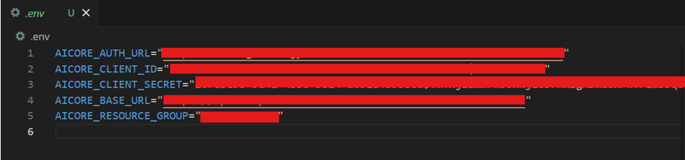
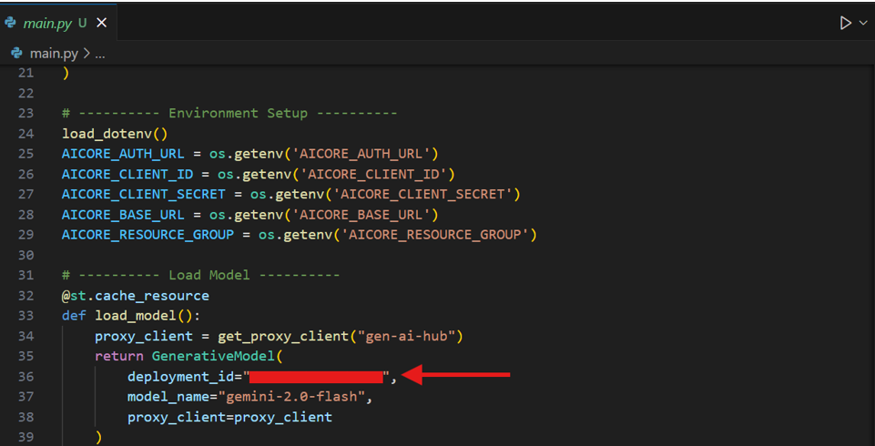

# 🧠⚡ Multimodal Intelligent Response Assistant

Interact using **voice**, **text**, **images**, or **video** — and receive intelligent responses powered by **multimodal generative AI**.

---

## 🚀 Overview

The **Multimodal Intelligent Response Assistant** is a web-based chatbot application that leverages **SAP Generative AI Hub** to connect with advanced Large Language Models (LLMs), specifically **Gemini 2.0 Flash**, enabling multimodal interaction.

Users can ask questions or submit inputs using **text**, **audio**, **images**, or **video** and receive context-aware responses. Designed for modern enterprise needs, this assistant is ideal for tasks like customer support, media analysis, education, and technical troubleshooting.

---

## 🧩 Core Capabilities

| Modality       | Description                                                                 |
|----------------|-----------------------------------------------------------------------------|
| **Text**       | Natural language input for general Q&A and conversational flow              |
| **Audio**      | Upload or record audio; transcribe or analyze content                       |
| **Image**      | Upload an image to detect objects, read text, or ask contextual questions   |
| **Video**      | Understand and analyze actions or context from short clips                  |
| **Multimodal** | Combine modalities (e.g., audio + text) for enriched, context-aware queries |
| **Chat Memory**| Maintains conversational state for continuous interaction                   |

---

## 🛠️ Architecture

1. **Streamlit UI** – Interactive, responsive frontend
2. **Input Processor** – Handles and formats media inputs
3. **Multimodal Preprocessing** – Tailors inputs (image, audio, etc.) for LLM
4. **LLM Integration** – Gemini 2.0 Flash via SAP Gen AI Hub Proxy
5. **Response Engine** – Intelligent answers based on input context
6. **Session Memory** – Keeps track of chat history

---

## 📋 Setup Instructions

### 🔧 1. Clone the Project
```bash
git clone <your-repo-url>
cd <your-repo-folder>
```

### 🔐 2. Configure Environment Variables

Create a `.env` file in the root directory and fill in your SAP AI Core credentials:

```env
AICORE_AUTH_URL="your-authentication-url"
AICORE_CLIENT_ID="your-client-id"
AICORE_CLIENT_SECRET="your-client-secret"
AICORE_BASE_URL="your-base-api-url"
AICORE_RESOURCE_GROUP="your-resource-group"
```



> 📌 Ensure Gemini 2.0 Flash is deployed and update `MODEL_NAME` and `MODEL_ID` accordingly in your code.


---

## ▶️ Running the App

Run the following in your terminal:

```bash
streamlit run main.py
```

---

## 💡 How to Use

### 🎥 1. Video Upload
- Upload a video clip.
- Ask questions based on its content.
- 🔄 *Click “Clear” to reset before new input.*

### 🔊 2. Audio Upload
- Upload an audio file or record your voice.
- Analyze speech or transcribe it.
- 🔄 *Click “Clear” before switching input types.*

### 🖼️ 3. Image Analysis
- Upload an image.
- Ask AI to describe, interpret, or extract info from it.
- 🔄 *Clear previous inputs before continuing.*

### ✍️ 4. Text Interaction
- Type questions directly.
- Continue contextual conversation.
- 🔄 *Use “Clear” to reset dialogue.*

### 🎙️ 5. Voice Recording
- Use the microphone to ask questions in real time.
- Immediate transcription and response.
- 🔄 *Reset for a new prompt by clicking “Clear.”*

---

## 📦 Tech Stack

- **Frontend**: Streamlit
- **AI Model**: Gemini 2.0 Flash (via SAP Gen AI Hub)
- **Backend**: Python
- **Media Handling**: base64, Pillow, optional Whisper (STT)
- **Environment**: python-dotenv
- **Audio Capture**: streamlit-mic-recorder

---

## 🎯 Use Case Scenarios

| Scenario             | Benefit                                                                |
|----------------------|------------------------------------------------------------------------|
| 📚 Education          | Ask about diagrams or lecture audio                                    |
| 🛠️ Tech Support       | Upload media (screen recording, voice note) for instant help          |
| 🎥 Media Analysis     | Understand summaries of videos or clips                                |
| 📞 Voice Assistants   | Integrate voice support into business workflows                        |
| 🏢 Enterprise Insights | Turn user-submitted media into structured insights                     |

---

## 🎥 Demo Video
 
Watch the full demo: The demo walkthrough video is available in the [`Demo Video`](./Demo%20Video/) folder of this repository.

---

## 📣 Final Thoughts

This project shows how **multimodal AI** transforms user interaction. With voice, visuals, and context-awareness, the assistant provides a rich, intuitive experience — powered by SAP’s most advanced AI models.
